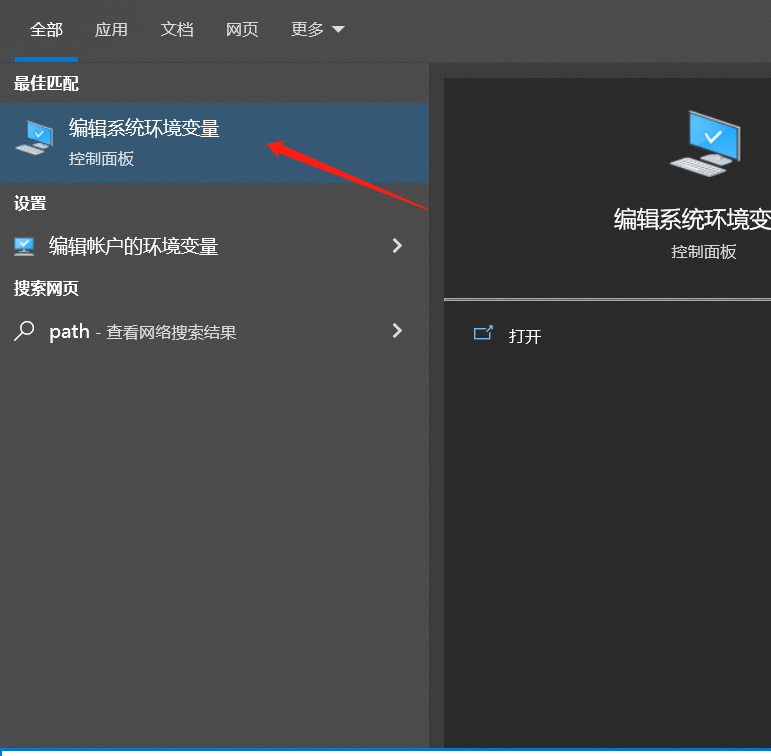
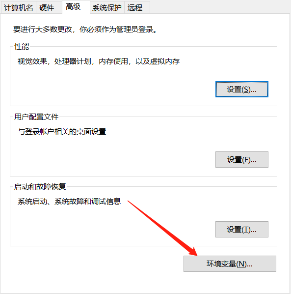
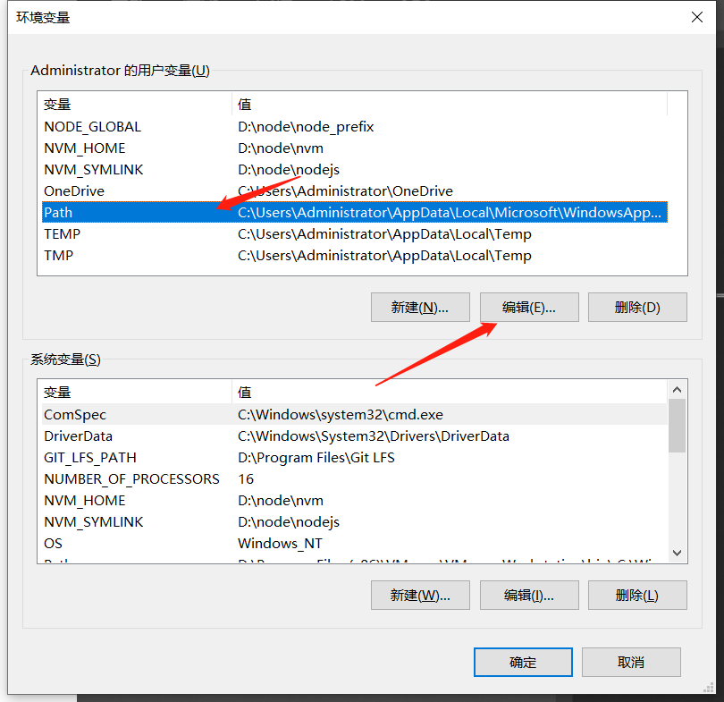
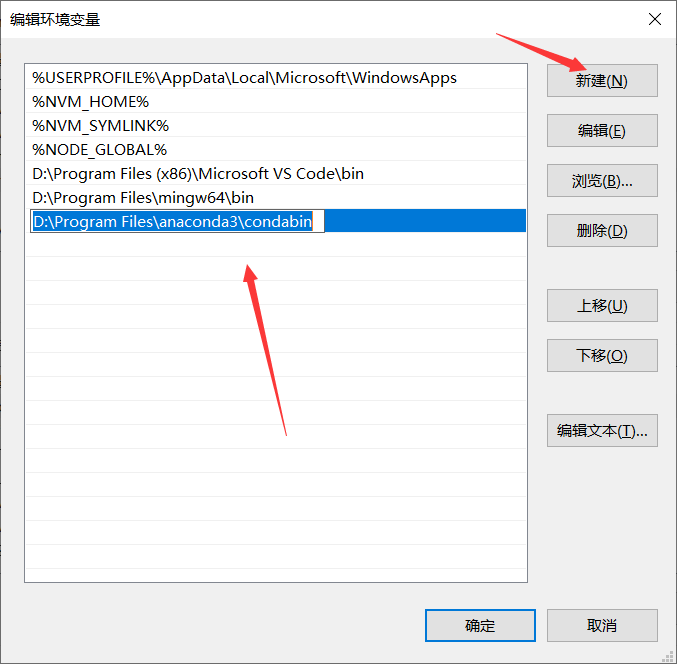
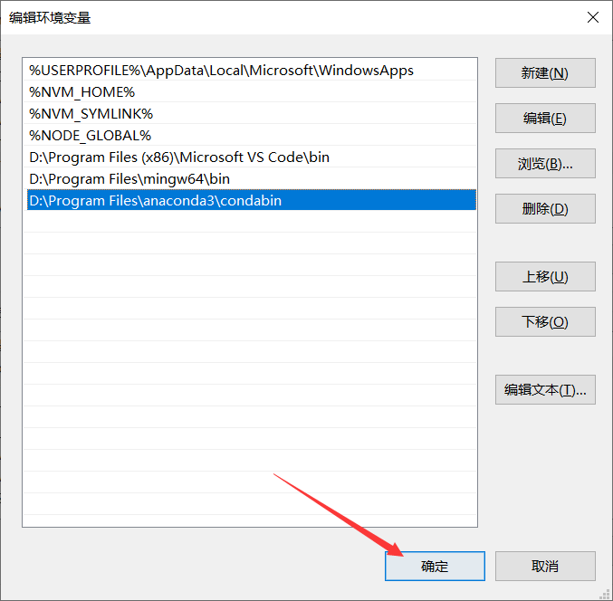
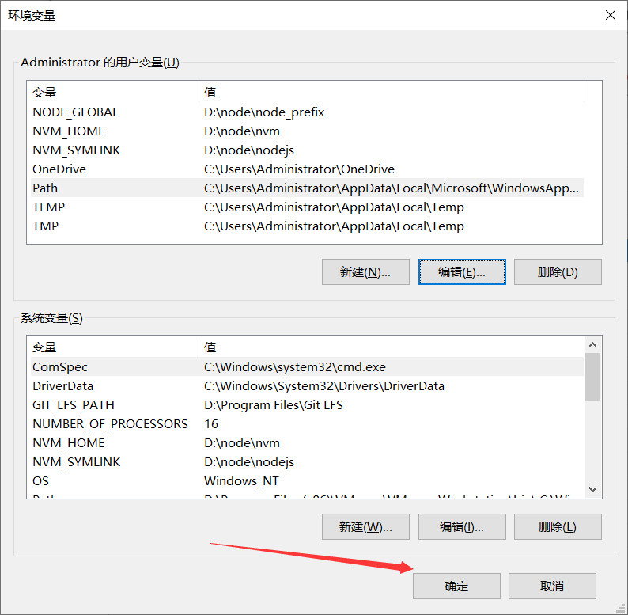
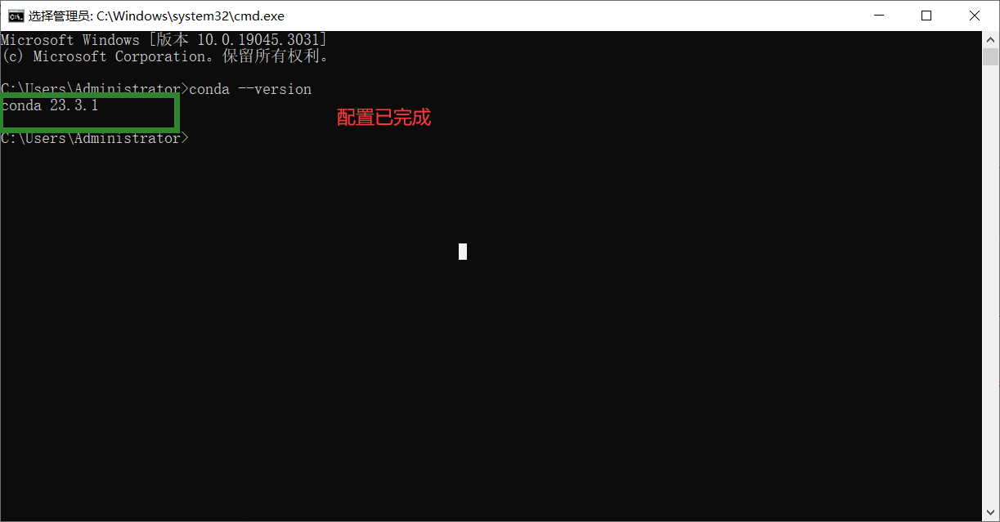

# ChatGPT DF 实战课

## 第一章 项目介绍

> 该项目使用 `ChatAI （聊天机器人） + Stable Diffusion 项目开放的接口 + Python  实现的一个简单应用`
>
> 该应用能够实现了 `文生图`的基本功能，并且可以实现参数的微调，进行生成不同的图片
>
> 内置用户模块的简单功能，如：`登录、注册、退出、记录用户图片生成记录，展示用户的图片列表`
>
> 整个项目大部分代码使用 `ChatAI` 进行生成，然后针对部分代码进行微调。


## 第二章 开发环境的准备

> 开发的时候，我们需要在本地配置 `Python` 环境，这里直接安装 `Python.exe` 或者使用 `conda` 配置环境都可以
>
> conda 官网 ：https://www.anaconda.com/
>
> Python 官网：https://www.python.org/

`在window 使用 conda 命令行的方式管理环境`
















`配置完成后，打开命名行，输入 conda --version`




`创建环境`

```
conda --create 环境名

conda activate 环境名称
```


## 第三章 静态页面

### 3.1 创建基本项目

`代码示例`

```python
from flask import Flask

app = Flask(__name__)


@app.route('/')
def index():
    return 'Hello, World'


if __name__ == '__main__':
    app.run(port=9526, debug=True)

```

`提示词`

```
我想创建一个基本的 flask 应用应该怎么做
```


### 3.2 生成路由

`代码示例`

```
from flask import Flask

app = Flask(__name__)


# 首页
@app.route('/')
def index():
    return 'Hello, World'

# 登录
@app.route('/login')
def login():
    return '登录成功'

# 注册
@app.route('/register')
def register():
    return '注册成功'

# 图片列表
@app.route('/imglist')
def imglist():
    return '图片列表'


if __name__ == '__main__':
    app.run(port=9526, debug=True)

```


`提示词`

```
from flask import Flask

app = Flask(__name__)


# 首页
@app.route('/')
def index():
    return 'Hello, World'

# 登录

# 注册

# 图片列表


if __name__ == '__main__':
    app.run(port=9526, debug=True)
    
我需要你帮我定义一个登录的路由，路径是 /login ，返回文本 '登录成功'
我需要你帮我定义一个注册的路由，路径是 /register ，返回文本 '注册成功'
我需要你帮我定义一个图片列表的路由，路径是 /imglist ，返回文本 '图片列表'

```


### 3.3 注册页面

`代码示例`

```html
<head>
    <meta charset="utf-8">
    <title>注册页面</title>
    <style>
        body {
            background-color: #f4f4f4;
        }

        .container {
            width: 100%;
            height: 100%;
            display: flex;
            justify-content: center;
            align-items: center;
        }

        .form {
            margin-top: 150px;
            background-color: #fff;
            padding: 20px;
            width: 500px;
            box-shadow: 0 0 10px rgba(0, 0, 0, 0.3);
            border-radius: 5px;
            animation: slide-in 0.5s ease-out;
        }

        .form h2 {
            text-align: center;
            margin-bottom: 20px;
        }

        .form label {
            display: block;
            margin-bottom: 10px;
            font-weight: bold;
        }

        .form input[type="text"],
        .form input[type="password"] {
            width: 100%;
            padding: 10px;
            border: 1px solid #ccc;
            border-radius: 3px;
            margin-bottom: 20px;
            box-sizing: border-box;
        }

        .form input[type="submit"] {
            width: 100%;
            background-color: #4CAF50;
            color: #fff;
            padding: 10px 20px;
            border: none;
            border-radius: 3px;
            cursor: pointer;
            transition: background-color 0.3s;
        }

        .form input[type="submit"]:hover {
            background-color: #3e8e41;
        }

        .form p {
            text-align: center;
            margin-top: 20px;
        }

        .form p a {
            color: #4CAF50;
            text-decoration: none;
        }

        @keyframes slide-in {
            from {
                transform: translateY(-100%);
            }

            to {
                transform: translateY(0);
            }
        }
    </style>
</head>

<body>
    <div class="container">
        <form class="form" action="" method="post">
            <h2>用户注册</h2>
            <label for="username">用户账号</label>
            <input type="text" id="username" name="username" placeholder="请输入用户账号..." required>
            <label for="password">用户密码</label>
            <input type="password" id="password" name="password" placeholder="请输入用户密码..." required>
            <label for="confirm_password">重复密码</label>
            <input type="password" id="confirm_password" name="confirm_password" placeholder="请输入重复密码..." required>
            <input type="submit" value="注册">
            <p>已有账号？<a href="/login">去登陆</a></p>
        </form>
    </div>
</body>
```

`提示词`

```
我需要你帮我生成一个注册页面
这个页面的主题是浅色的，登录区域在水平方向和垂直方向居中显示
登录区域的宽度是 500px ，高度 由 内容区域撑开
登录区域有一个标题是 用户注册
有三个输入框分别是：
标题是 用户账号，字段是 username
标题是 用户密码，字段是 password
标题是 重复密码，字段是 confirm_password

还需要有一个友情提示：已有账号？去登陆

最下面就是一个注册的按钮了，按钮宽度是 100%
请根据我的需求生成对应的代码，最好具备简单的动画特效
使用 CSS  和 HTML 原生语法
```


### 3.4 登录页面

`代码示例`

```html
<head>
    <meta charset="utf-8">
    <title>登录页面</title>
    <style>
        body {
            background-color: #f4f4f4;
        }

        .container {
            width: 100%;
            height: 100%;
            display: flex;
            justify-content: center;
            align-items: center;
        }

        .form {
            margin-top: 150px;
            background-color: #fff;
            padding: 20px;
            width: 500px;
            box-shadow: 0 0 10px rgba(0, 0, 0, 0.3);
            border-radius: 5px;
            animation: slide-in 0.5s ease-out;
        }

        .form h2 {
            text-align: center;
            margin-bottom: 20px;
        }

        .form label {
            display: block;
            margin-bottom: 10px;
            font-weight: bold;
        }

        .form input[type="text"],
        .form input[type="password"] {
            width: 100%;
            padding: 10px;
            border: 1px solid #ccc;
            border-radius: 3px;
            margin-bottom: 20px;
            box-sizing: border-box;
        }

        .form input[type="submit"] {
            width: 100%;
            background-color: #4CAF50;
            color: #fff;
            padding: 10px 20px;
            border: none;
            border-radius: 3px;
            cursor: pointer;
            transition: background-color 0.3s;
        }

        .form input[type="submit"]:hover {
            background-color: #3e8e41;
        }

        .form p {
            text-align: center;
            margin-top: 20px;
        }

        .form p a {
            color: #4CAF50;
            text-decoration: none;
        }

        @keyframes slide-in {
            from {
                transform: translateY(-100%);
            }

            to {
                transform: translateY(0);
            }
        }
    </style>
</head>

<body>
    <div class="container">
        <form class="form" action="" method="post">
            <h2>用户登录</h2>
            <label for="username">用户账号</label>
            <input type="text" id="username" name="username" placeholder="请输入用户账号..." required>
            <label for="password">用户密码</label>
            <input type="password" id="password" name="password" placeholder="请输入用户密码..." required>
            <input type="submit" value="登录">
            <p>还没有账号？<a href="/register">去注册</a></p>
        </form>
    </div>
</body>
```


`提示词`

```

# 上放可放入注册页面的代码（这里省略掉了）

请帮我把这个注册页面的代码，修改为登录页面的代码

登录页面只有两个 input 框：

标题：用户账号 字段:username 

标题：用户密码 字段:password 

提示词 ：还没有账号？去注册
```


### 3.5 首页页面

`CSS 代码`

```css
* {
            box-sizing: border-box;
            margin: 0;
            padding: 0;
        }


        /* 设置顶部导航栏样式 */

        header {
            width: 100%;
            height: 60px;
            background-color: #428bca;
            line-height: 60px;
        }

        header .container {
            width: 1400px;
            margin: 0 auto;
        }

        .navigation-menu {
            display: flex;
            /* 将列表项居中对齐 */
            list-style: none;
            margin: 0;
            padding: 0;
        }

        .navigation-menu li {
            margin-right: 20px;

            /* 添加悬停动画效果 修改背景颜色和文本颜色*/
        }

        .navigation-menu li:hover>a {
            background-color: skyblue;

        }

        .navigation-menu li>a {
            padding: 0 20px;
            display: block;
            color: #fff;
            text-decoration: none;
        }

        .userinfo {
            color: #fff;
        }

        .userinfo .username {
            font-weight: bold;
        }

        .userinfo .logout-link {
            color: #fff;
            text-decoration: none;
        }

        .form-wrapper {
            width: 1400px;
            margin: 0 auto;
            display: flex;
            justify-content: space-between;
            flex-wrap: wrap;
        }

        .left-area {
            width: 900px;
            padding-right: 50px;
        }

        .right-area {
            width: 500px;
        }

        .input-group {
            margin: 10px 0;
            padding-bottom: 10px;
            border-bottom: 1px solid #ccc;
        }

        label {
            font-size: 14px;
            font-weight: bold;
            margin-right: 5px;
        }

        select,
        input[type="text"],
        textarea {
            margin-top: 10px;
            padding: 5px;
            font-size: 16px;
            border-radius: 4px;
            border: 1px solid #ccc;
            width: 100%;
        }

        input[type="range"] {
            width: calc(70%);
            margin-left: 30%;
        }

        button[type="submit"] {
            background-color: #428bca;
            color: white;
            border: none;
            padding: 10px;
            font-size: 16px;
            cursor: pointer;
            width: 100%;
            margin-top: 20px;
        }

        .waiting-area {
            border: 2px dashed #ccc;
            padding: 20px 20px 0;
            margin-top: 20px;
            display: flex;
            align-items: flex-start;
            flex-wrap: wrap;
            justify-content: space-between;
            overflow: auto;
        }

        .waiting-area::after {
            content: '';
            display: block;
            width: 30%;
        }

        .waiting-area img {
            width: 30%;
            display: block;
            margin-bottom: 20px;
        }

        .waiting-area p {
            margin-bottom: 20px;
        }
```

`HTML 代码`

```html
<style>
    * {
        box-sizing: border-box;
        margin: 0;
        padding: 0;
    }

    header {
        background-color: #f5f5f5;
    }

    .nav {
        display: flex;
        align-items: center;
        height: 80px;
        background-color: #333;
    }

    .container {
        width: 1400px;
        margin: 0 auto;
        display: flex;
        justify-content: space-between;
        padding: 0 20px;
    }


    nav ul {
        display: flex;
        list-style: none;
    }

    nav ul li {
        margin-right: 20px;
    }

    nav ul li:last-child {
        margin-right: 0;
    }

    nav ul li a {
        font-size: 18px;
        font-weight: bold;
        text-decoration: none;
        color: #fff;
    }

    .user-info {
        display: flex;
        align-items: center;
        font-size: 18px;
        color: #fff;
        margin-left: auto;
    }

    .user-info span {
        margin-right: 10px;
    }

    .user-info a {
        font-size: 18px;
        color: #fff;
        text-decoration: none;
    }

    main {
        background-color: #fff;
    }

    .form-container {
        padding-top: 40px;
        background-color: #f5f5f5;
    }

    .form-left {
        width: 900px;
        padding-right: 40px;
    }

    .form-right {
        width: 500px;
        display: flex;
        flex-direction: column;
        align-items: center;
    }

    form {
        display: flex;
        flex-wrap: wrap;
    }

    .form-group {
        margin-bottom: 20px;
        width: 100%;
    }

    .form-group label {
        display: block;
        font-size: 18px;
        font-weight: bold;
        margin-bottom: 10px;
    }

    .form-group textarea {
        width: 100%;
        height: 75px;
        padding: 10px;
        border: 1px solid #ccc;
        border-radius: 5px;
        resize: none;
    }

    .form-group select {
        width: 100%;
        padding: 10px;
        border: 1px solid #ccc;
        border-radius: 5px;
    }

    .form-group input[type="number"] {
        width: 100%;
        padding: 10px;
        border: 1px solid #ccc;
        border-radius: 5px;
    }

    .range-container {
        display: flex;
    }

    .range-container input[type="range"] {
        width: 80%;
        margin-right: 10px;
    }

    .range-container input[type="number"] {
        width: 20%;
        padding: 10px;
        border: 1px solid #ccc;
        border-radius: 5px;
    }

    #submit-btn {
        width: 100%;
        padding: 10px;
        background-color: #333;
        color: #fff;
        font-size: 18px;
        font-weight: bold;
        border: none;
        border-radius: 5px;
        margin-bottom: 20px;
        cursor: pointer;
    }

    .task-container {
        border: 2px dashed #ccc;
        padding: 20px;
        border-radius: 5px;
        text-align: center;
        width: 100%;
        display: flex;
        flex-wrap: wrap;
    }

    .task-container img {
        padding: 10px;
        width: 33.33%;
    }

    .task-container p {
        font-size: 18px;
        font-weight: bold;
        color: #ccc;
        width: 100%;
    }
</style>

<body>
    <header>
        <div class="nav">
            <div class="container">
                <nav>
                    <ul>
                        <li><a href="/">首页</a></li>
                        <li><a href="/imglist">图片列表</a></li>
                    </ul>
                </nav>
                <div class="user-info">
                    欢迎回来：
                    <span>{{ session['userinfo']}}</span>
                    <a href="/logout">退出</a>
                </div>
            </div>
        </div>
    </header>
    <main>
        <div class="form-container">
            <div class="container">
                <div class="form-left">
                    <form>
                        <div class="form-group">
                            <label for="prompt">提示词</label>
                            <textarea id="prompt" name="prompt" placeholder="请输入提示词...">dog</textarea>
                        </div>
                        <div class="form-group">
                            <label for="negative-prompt">反向提示词</label>
                            <textarea id="negative-prompt" name="negative_prompt"
                                placeholder="请输入反向提示词...">paintings, sketches, lowres, normal quality, worst quality, low quality, cropped, dot, mole, ugly, grayscale, monochrome, duplicate, morbid, mutilated, missing fingers, extra fingers, too many fingers, fused fingers, mutated hands, bad hands, poorly drawn hands, poorly drawn face, poorly drawn eyebrows, bad anatomy, cloned face, long neck, extra legs, extra arms, missing arms missing legs, malformed limbs, deformed, simple background, bad proportions, disfigured, skin spots, skin blemishes, age spot, bad feet, error, text, extra digit, fewer digits, jpeg artifacts, signature, username, blurry, watermark, mask, logo</textarea>
                        </div>
                        <div class="form-group">
                            <label for="sampler-index">采样方法</label>
                            <select id="sampler-index" name="sampler_index">
                                <option value="Euler a">Euler a</option>
                                <option value="Euler">Euler</option>
                                <option value="LMS">LMS</option>
                                <option value="DDIM">DDIM</option>
                            </select>
                        </div>
                        <div class="form-group">
                            <label for="steps">采样迭代步数</label>
                            <div class="range-container">
                                <input type="range" id="steps-range" name="steps_range" min="1" max="150" value="20">
                                <input type="number" id="steps" name="steps" min="1" max="150" value="20">
                            </div>
                        </div>
                        <div class="form-group">
                            <label for="width">宽度</label>
                            <div class="range-container">
                                <input type="range" id="width-range" name="width_range" min="64" max="512" value="200">
                                <input type="number" id="width" name="width" min="64" max="512" value="200">
                            </div>
                        </div>
                        <div class="form-group">
                            <label for="height">高度</label>
                            <div class="range-container">
                                <input type="range" id="height-range" name="height_range" min="64" max="512"
                                    value="200">
                                <input type="number" id="height" name="height" min="64" max="512" value="200">
                            </div>
                        </div>

                        <div class="form-group">
                            <label for="cfg-scale">提示词相关性</label>
                            <div class="range-container">
                                <input type="range" id="cfg-scale-range" name="cfg_scale_range" min="1" max="30"
                                    value="7">
                                <input type="number" id="cfg-scale" name="cfg_scale" min="1" max="30" value="7">
                            </div>
                        </div>
                        <div class="form-group">
                            <label for="batch-size">生成数量</label>
                            <input type="number" id="batch-size" name="batch_size" min="1" value="1">
                        </div>
                        <div class="form-group">
                            <label for="seed">随机种子</label>
                            <input type="number" id="seed" name="seed" value="-1">
                        </div>
                    </form>
                </div>
                <div class="form-right">
                    <button id="submit-btn">提交</button>
                    <div class="task-container">
                        <p>暂无任务</p>
                    </div>
                </div>
            </div>
        </div>
    </main>
</body>
<script>
    const stepsRange = document.getElementById('steps-range');
    const steps = document.getElementById('steps');
    const widthRange = document.getElementById('width-range');
    const width = document.getElementById('width');
    const heightRange = document.getElementById('height-range');
    const height = document.getElementById('height');
    const cfgScaleRange = document.getElementById('cfg-scale-range');
    const cfgScale = document.getElementById('cfg-scale');
    const submitBtn = document.getElementById('submit-btn');
    const taskContainer = document.querySelector('.task-container');

    stepsRange.addEventListener('input', () => {
        steps.value = stepsRange.value;
    });

    steps.addEventListener('input', () => {
        stepsRange.value = steps.value;
    });

    widthRange.addEventListener('input', () => {
        width.value = widthRange.value;
    });

    width.addEventListener('input', () => {
        widthRange.value = width.value;
    });

    heightRange.addEventListener('input', () => {
        height.value = heightRange.value;
    });

    height.addEventListener('input', () => {
        heightRange.value = height.value;
    });

    cfgScaleRange.addEventListener('input', () => {
        cfgScale.value = cfgScaleRange.value;
    });

    cfgScale.addEventListener('input', () => {
        cfgScaleRange.value = cfgScale.value;
    })
</script>
```


`提示词`

```
我需要你帮我生成一个首页的代码
首页的上面是一个顶部导航，宽度是百分之百，有一个背景色。浅色调。
导航里面有个版心区域，宽度是 1400px 水平居中
版心区域里面有左右两部分，左边是导航条，右边是用户信息

导航条里面有两个导航，分别是首页 和 图片列表。

用户信息，里面有 用户名称 | 退出链接

顶部导航下面是一个表单区域
表单区域的结构也分为左右 两部分。表单区域的宽度也是 1400px 水平居中

左边内容区域宽度是900px ，右边内容区域宽度是500px
左边内容区域是一个表单区域，表单内容如下：
标题：提示词，标签：textarea，字段：prompt
标题：反向提示词，标签：textarea，字段：negative_prompt
标题：采样方法，标签：select，字段：sampler_index
标题：采样迭代步数，标签：input，字段：steps。动态效果：可以通过拖拽对应的进度条调整数值，拖拽进度条可以对原 input 标签的值的数据回显， 进度条最小值为 1 最大值为 150
标题：宽度，标签：input，字段：width。动态效果：可以通过拖拽对应的进度条调整数值，拖拽进度条可以对原 input 标签的值的数据回显， 进度条最小值为 64 最大值为 512
标题：高度，标签：input，字段：height。动态效果：可以通过拖拽对应的进度条调整数值，拖拽进度条可以对原 input 标签的值的数据回显， 进度条最小值为 64 最大值为 512
标题：提示词相关性，标签：input，字段：cfg_scale。动态效果：可以通过拖拽对应的进度条调整数值，拖拽进度条可以对原 input 标签的值的数据回显， 进度条最小值为 1 最大值为 30
标题：生成数量，标签：input，字段：batch_size，默认值为 1
标题：随机种子，标签：input，字段：seed，默认值为 -1


右边内容区域上面是一个提交按钮，这个按钮的宽度是百分百
按钮下面有一个区域，这个区域使用虚线边框进行提示，告诉用户。这里等待着图片显示
默认文本为：暂无任务

页面上我希望使用一些动态特效，请使用基本的 HTML  CSS JS 实现。
请根据我的要求生成对应代码
```


### 3.6 图片列表

> 使用 `ChatAI` 生成基本的静态页面，并且具备基本的动态效果，如图片预览功能

`CSS 代码`

```CSS
    <style>
        * {
            box-sizing: border-box;
            margin: 0;
            padding: 0;
        }

        header {
            background-color: #f5f5f5;
        }

        .nav {
            display: flex;
            align-items: center;
            height: 80px;
            background-color: #333;
        }

        .container {
            width: 1400px;
            margin: 0 auto;
            display: flex;
            justify-content: space-between;
            padding: 0 20px;
        }


        nav ul {
            display: flex;
            list-style: none;
        }

        nav ul li {
            margin-right: 20px;
        }

        nav ul li:last-child {
            margin-right: 0;
        }

        nav ul li a {
            font-size: 18px;
            font-weight: bold;
            text-decoration: none;
            color: #fff;
        }

        .user-info {
            display: flex;
            align-items: center;
            font-size: 18px;
            color: #fff;
            margin-left: auto;
        }

        .user-info span {
            margin-right: 10px;
        }

        .user-info a {
            font-size: 18px;
            color: #fff;
            text-decoration: none;
        }

        main {
            width: 1400px;
            margin: 40px auto;
            display: flex;
            flex-wrap: wrap;
            justify-content: flex-start;
        }

        .img-box {
            width: 20%;
            padding: 15px;
            text-align: center;
            font-size: 14px;
        }

        .image-container {
            padding: 10px;
            box-shadow: 0 0 10px rgba(0, 0, 0, 0.2);
        }

        .image-container img {
            width: 100%;
            height: auto;
        }

        .image-container .date {
            /* margin-top: 10px; */
            line-height: 30px;
            font-weight: bold;
            text-align: center;
        }

        .image-container button {
            width: 100%;
            padding: 10px;
            font-size: 14px;
            background-color: #333;
            color: #fff;
            border: none;
            cursor: pointer;
        }

        .modal {
            position: fixed;
            top: 0;
            left: 0;
            width: 100%;
            height: 100%;
            background-color: rgba(0, 0, 0, 0.7);
            display: flex;
            justify-content: center;
            align-items: center;
            z-index: 999;
            opacity: 0;
            pointer-events: none;
            transition: all 0.3s ease;
        }

        .modal.active {
            opacity: 1;
            pointer-events: auto;
        }

        .modal-content {
            position: relative;
            width: 80%;
            max-width: 800px;
            background-color: #fff;
            padding: 20px;
            box-shadow: 0 0 10px rgba(0, 0, 0, 0.2);
            text-align: center;
        }

        .modal-content img {
            max-width: 100%;
            max-height: 80vh;
        }

        .close-btn {
            position: absolute;
            top: 20px;
            right: 20px;
            width: 40px;
            height: 40px;
            background-color: #Fff;
            color: #000;
            font-size: 28px;
            line-height: 40px;
            text-align: center;
            border-radius: 50%;
            cursor: pointer;
        }
    </style>
```

`HTML 代码`

```
   <header>
        <div class="nav">
            <div class="container">
                <nav>
                    <ul>
                        <li><a href="/">首页</a></li>
                        <li><a href="/imglist">图片列表</a></li>
                    </ul>
                </nav>
                <div class="user-info">
                    欢迎回来：
                    <span>{{ session['userinfo']}}</span>
                    <a href="/logout">退出</a>
                </div>
            </div>
        </div>
    </header>
    <main>
        
        <div class="img-box">
            <div class="image-container">
                
                <div class="date">生成日期：{{ img.date }}</div>
                <button>预览</button>
            </div>
        </div>
        

    </main>
```

`JS 代码`

```js
   const modal = document.querySelector('.modal');
        const closeBtn = document.querySelector('.close-btn');
        const previewBtns = document.querySelectorAll('button');

        previewBtns.forEach((btn, index) => {
            btn.addEventListener('click', function () {
                document.querySelector('.modal img').src = this.parentElement.querySelector('img').src
                modal.classList.add('active');
            });
        });

        closeBtn.addEventListener('click', () => {
            modal.classList.remove('active');
        });
```

`提示词`

```
这是一个图片列表的页面，目前只有导航区域

main标签是图片列表的内容区域，你需要该标签里补全对应代码

main 的宽度是 1400px 像素，水平居中

在图片列表区域内，每一行显示 5 个图片容器，每个图片容器之间都有一些距离，可以使用内补白的方式，实现图片之间距离。图片容器内容上部分是显示的图片


下部分显示的图片的生成日期，如：生成日期：2023-06-26 ，生成日期下面是预览按钮。按钮的宽度是 100%

当我点击预览按钮的时候，会显示一个模态框，模态框里显示实际图片的大小。并且模态框具备关闭的功能

所有的图片地址都以：http://127.0.0.1:9527/static/2023-06-26/0_27896926.png 地址，为测试地址


请根据我的需求给出对应的代码
```


## 第四章 后端功能

### 4.1 用户注册

> 前端功能：用户注册 `ajax` 请求发送
>
> 后端功能：用户注册成功后，写入用户列表数据，否则返回错误信息。

`前端`

```html
<body>
    <div class="container">
        <form class="form" action="" method="post">
            <h2>用户注册</h2>
            <label for="username">用户账号</label>
            <input type="text" id="username" name="username" placeholder="请输入用户账号..." required>
            <label for="password">用户密码</label>
            <input type="password" id="password" name="password" placeholder="请输入用户密码..." required>
            <label for="confirm_password">重复密码</label>
            <input type="password" id="confirm_password" name="confirm_password" placeholder="请输入重复密码..." required>
            <input type="submit" value="注册">
            <p>已有账号？<a href="/login">去登陆</a></p>
        </form>
    </div>
</body>
<script>
    const form = document.querySelector('.form');
    const usernameInput = document.getElementById('username');
    const passwordInput = document.getElementById('password');
    const confirmPasswordInput = document.getElementById('confirm_password');

    form.addEventListener('submit', (event) => {
        event.preventDefault(); // 阻止表单默认提交行为

        const username = usernameInput.value.trim();
        const password = passwordInput.value.trim();
        const confirmPassword = confirmPasswordInput.value.trim();

        // 简单的校验
        if (!username || !password || !confirmPassword) {
            alert('请填写完整信息');
            return;
        }
        if (password !== confirmPassword) {
            alert('两次密码输入不一致');
            return;
        }

        // 发送请求
        const xhr = new XMLHttpRequest();
        xhr.open('POST', '/register');
        xhr.setRequestHeader('Content-type', 'application/json');
        xhr.onreadystatechange = function () {
            if (xhr.readyState === 4 && xhr.status === 200) {
                const response = JSON.parse(xhr.responseText);
                alert(response.message);
                if (response.code === 1) {
                    window.location.href = '/login';
                }
            }
        }
        xhr.send(JSON.stringify({ username, password }));
    });

</script>
```

`提示词`

```
        <form class="form" action="" method="post">
            <h2>用户注册</h2>
            <label for="username">用户账号</label>
            <input type="text" id="username" name="username" required>
            <label for="password">用户密码</label>
            <input type="password" id="password" name="password" required>
            <label for="confirm_password">重复密码</label>
            <input type="password" id="confirm_password" name="confirm_password" required>
            <input type="submit" value="注册">
            <p>已有账号？<a href="#">去登陆</a></p>
        </form>


这是我注册页面的表单结构 ，我需要你使用 ajax 发送注册请求（使用 JS 原生写法）

在请求发送之前，需要对数据进行简单的校验

校验成功后，我需要你向 /register 地址发送请求，然后通过后台后台返回的 json 数据，进行提示

这里假设使用 const response  接受返回的json 数据 

如果 response.code 为 1 说明注册成功，请你帮我跳转到  /login 

否则就是注册失败，alert(response.message)
```


`后端`

```python

# 注册
@app.route('/register', methods=['GET', 'POST'])
def register():
    if request.method == 'GET':
        # 渲染 register.html 模板文件并返回
        return render_template('register.html')
    else:
        data = request.get_json()
        username = data.get('username')
        password = data.get('password')

        try:
            with open('./data/userlist.json', 'r') as f:
                userlist = json.load(f)
        except FileNotFoundError:
            userlist = {}

        if username in userlist:
            return jsonify({'code': 0, 'message': '注册失败，用户名已经被使用了'})

        password = hashlib.md5(password.encode('utf-8')).hexdigest()
        date = datetime.date.today().strftime('%Y-%m-%d')

        userlist[username] = {'username': username, 'password': password, 'register_date': date}

        with open('./data/userlist.json', 'w+') as f:
            json.dump(userlist, f, indent=4)

        return jsonify({'code': 1, 'message': '恭喜您注册成功'})
```


`提示词`

```
@app.route('/register', methods=['GET', 'POST'])
def register():
    if request.method == 'GET':
        # 渲染 register.html 模板文件并返回
        return render_template('register.html')
    else:
        return jsonify({'code': 1, 'message': '恭喜您注册成功'})
    


我需要你帮我接受前台 ajax 传递过来的数据，类型是 json

你需要获取的属性名分别是 username 、password

然后读取 ./data/userlist.json 文件，该文件的格式为 ：{}

在读取 ./data/userlist.json 文件之前，你需要帮我先判断一下这个文件是否存在，如果不存在就帮我创建。然后写入一个空数据：{}

如果 username 的值，存在于这个对象的属性当中，说明该用户名已经被注册了。
我们需要返回 json 格式数据：{'code':0,'message':'注册失败，用户名已经被使用了'}

否则就说用户名可用，我们需要对密码进行 md5 进行加密
然后取当前的日期，日期格式为：年-月-日。
然后把用户名，用户密码，注册时间，拼接为一个字典：{'username':username,'password':password,'register_date':date}
然后将该字典数据写到 userlist 对象的 username 属性上，然后重新把 userlist 这个对象，写入到 userlist.json 文件当中

写入的时候格式化一下 json 文件的缩进为 4 个空格
```


### 4.2 登录功能

#### 4.3.1 cookie 和 session

`cookie`

> 在 `WEB` 应用中 `HTTP` 的请求是无状态的。在用户第一次登录成功后。下次登录我依然不知道你是哪个用 户 
>
> `Cookie` 的出现就是为了解决这个问题，用户在登录成功后服务器会返回一些数据，浏览器会把这些数据 保存在本地
>
>  用户再次发送请求时，就会自动带上这些数据。服务器通过请求中携带的数据就能够判断用户的身份

`session`

> `Session` 的作用和 `Cookie` 有点些类似，都是用于存储数据。 而区别就在与 `Cookie` 是把数据存储在本地， 而 `Session` 是把数据存储在服务器中。
>
> `Session` 的出现是为了解决 `Cookie` 储存数据不安全的问题

`结合使用`

> 现如今 `Session` 和 `Cookie` 通常用于结合使用
>
>  如果用户成功登录，则会吧用户信息存入 `Session` 当中然后将 `SessionID` 返回给客户端 
>
> 而返回 `SessionID` 则被保存在浏览器的 `Cookie` 当中 当下次访问的时候，请求中会携带着这个 `Cookie`
>
> 而服务器就会拿到这个 `Cookie` 里面的 `SessionID` 然后通过这个 `SessionID`来找到里面存储的用户信息
>
> 假如请求没有携带这个 `Cookie` 或者 Cookie 中携带的 `SessionID` 无效
>
> 则说明改用户认证没有通过 这个时候就可以通过查找的结果，来进行分别处理


#### 4.3.2 用户登录

> 前端功能：前端 `ajax` 请求。
>
> 后端功能：用户登录成功后，记录登录状态 

`前端`

```html
<body>
    <div class="container">
        <form class="form" action="" method="post">
            <h2>用户登录</h2>
            <label for="username">用户账号</label>
            <input type="text" id="username" name="username" placeholder="请输入用户账号..." required>
            <label for="password">用户密码</label>
            <input type="password" id="password" name="password" placeholder="请输入用户密码..." required>
            <input type="submit" value="登录">
            <p>还没有账号？<a href="/register">去注册</a></p>
        </form>
    </div>
</body>
<script>
    const form = document.querySelector('.form');
    form.addEventListener('submit', function (event) {
        event.preventDefault(); // 阻止表单默认提交行为
        const username = document.getElementById('username').value;
        const password = document.getElementById('password').value;
        // 进行数据校验
        if (!username || !password) {
            alert('请输入用户名和密码');
            return;
        }
        // 发送登录请求
        const xhr = new XMLHttpRequest();
        xhr.open('POST', '/login');
        xhr.setRequestHeader('Content-Type', 'application/json');
        xhr.onreadystatechange = function () {
            if (xhr.readyState === 4 && xhr.status === 200) {
                const response = JSON.parse(xhr.responseText);
                alert(response.message);
                if (response.code === 1) {
                    // 登录成功，跳转到首页
                    window.location.href = '/';
                }
            }

        };
        xhr.send(JSON.stringify({ username, password }));
    });

</script>

```


`后端`

```python
@app.route('/login', methods=['GET', 'POST'])
def login():
    if request.method == 'GET':
        # 渲染 login.html 模板文件并返回
        return render_template('login.html')
    
    # 处理 POST 请求
    data = request.get_json()
    username = data.get('username')
    password = data.get('password')
    
    # 读取 userlist.json 文件
    try:
        with open('./data/userlist.json', 'r') as f:
            userlist = json.load(f)
    except FileNotFoundError:
        return jsonify({'code': 0, 'message': '账号或者密码错误'})
    
    # 判断 username 是否为 userlist 对象的属性
    if username not in userlist:
        return jsonify({'code': 0, 'message': '账号或者密码错误'})
    
    # 对密码进行校验
    password_md5 = hashlib.md5(password.encode('utf-8')).hexdigest()
    if password_md5 != userlist[username]['password']:
        return jsonify({'code': 0, 'message': '账号或者密码错误'})
    
    # 将用户信息写入 session
    session['userinfo'] = username
    
    return jsonify({'code': 1, 'message': '登录成功'})
```


`提示词`

```
@app.route('/login', methods=['GET', 'POST'])
def login():
    if request.method == 'GET':
        # 渲染 login.html 模板文件并返回
        return render_template('login.html')
    
    # 处理 POST 请求
    return jsonify({'code': 0, 'message': '登录成功'})


我需要你帮我接受前端 ajax 传递过来的数据，类型是 json
你需要获取到的属性名是 username 和 password

然后读取 ./data/userlist.json ，该文件的格式为:{}

你需要考虑到文件不存在的情况，如果文件不存在，我们直接返回:{'code':0,'message':'账号或者密码错误'}


如果文件存在我们需要判断 username 的值是否为 userlist 这个对象的属性，如果该对象不存在 username变量值的属性那么说明账号错误，我们直接返回:{'code':0,'message':'账号或者密码错误'}

否则就需要对密码进行校验了
然后我们对 password 的密码进行 md5 加密 ，如果密码也正确，我们需要把用户的信息写入到 session ，session 属性名为 userinfo ，值为 username 的值

然后返回给前端：{'code':1,'message':'登录成功'}
```


### 4.3 身份验证

> 身份校验：指定路由必须完成登录后才能正常访问
>
> 校验路由列表：`首页、图片列表`

`首页路由`

```python
#首页路由
@app.route("/")
def home():
    
    # 如果未登录，就跳转到 login
    if 'userinfo' not in session:
        return redirect('/login')
    
    # 已登录，渲染模板
    return render_template("index.html")
```


`图片列表路由`

```python
# 图片列表的路由
@app.route('/imglist')
def img_list():
    # 如果未登录，就跳转到 login
    if 'userinfo' not in session:
        return redirect('/login')
    
    # 已登录，渲染模板
    return render_template('imglist.html')

```


`提示词`

```
# 首页
@app.route('/')
def index():

    # 如果未登录，就跳转到 login

    # 如果已经登录，才展示模板文件
    return render_template('index.html')


这是我的首页路由
我需要你帮我对该路径进行身份校验

如果 session 的 userinfo 信息不存在，就跳转到 /login
如果存在才返回模板文件，请根据以上需求帮我修改对应代码
```


### 4.4 退出功能

> 前端：在导航列表右侧显示登录的用户信息，并增加退出连接，如：`张三 | 退出`
>
> 后端：增加退出 `/logout` 路由，并删除登录成功后写入的用户数据，随后跳转到登录页面，完成退出操作

`代码示例`

```python
# 退出
@app.route('/logout')
def logout():
    session.pop('userinfo', None)
    return redirect('/login')

```

`提示词`

```
请帮我定义一个 /logout 路由用于处理退出请求
清除 session 的 userinfo 数据后，跳转到 /login
```


### 4.5 测试 SD 文生图接口

> `Stable Diffusion 的接口模式需要，在启动 Stable Diffusion  项目时增加 --api 指令`
>
> 通过该指令启动，`Stable Diffusion` 的 `API` 接口访问模式就会被开启，接口文档地址：`项目地址/docs`

#### 请求地址

> `方法 ：POST`
>
> `地址`：`项目url/sdapi/v1/txt2img`

#### 请求参数

| 名称            | 类型   | 说明               |
| --------------- | ------ | ------------------ |
| prompt          | string | 正向提示词         |
| negative_prompt | string | 反向提示词         |
| width           | int    | 图片高度           |
| height          | int    | 图片宽度           |
| sampler_index   | string | 采样方法           |
| steps           | int    | 采样迭代步数       |
| seed            | int    | 随机种子数         |
| batch_size      | int    | 单批次生成图片数量 |
| cfg_scale       | int    | 提示词相关性       |


#### 返回示例

```json
{
    "images":[
        "base64文件流数据"
    ]
}
```


`说明`

- 返回的是一个 `json` 格式的数据， images 数组中，每个单元都是一张图片的数据流


### 4.6 实现项目接口地址

> 生成图片接口的所有参数都由前端进行传递

#### 4.6.1  项目接口实现 1

`HTML 代码`

```html
  <div class="container">
                <div class="form-left">
                    <form>
                        <div class="form-group">
                            <label for="prompt">提示词</label>
                            <textarea id="prompt" name="prompt" placeholder="请输入提示词...">dog</textarea>
                        </div>
                        <div class="form-group">
                            <label for="negative-prompt">反向提示词</label>
                            <textarea id="negative-prompt" name="negative_prompt"
                                placeholder="请输入反向提示词...">paintings, sketches, lowres, normal quality, worst quality, low quality, cropped, dot, mole, ugly, grayscale, monochrome, duplicate, morbid, mutilated, missing fingers, extra fingers, too many fingers, fused fingers, mutated hands, bad hands, poorly drawn hands, poorly drawn face, poorly drawn eyebrows, bad anatomy, cloned face, long neck, extra legs, extra arms, missing arms missing legs, malformed limbs, deformed, simple background, bad proportions, disfigured, skin spots, skin blemishes, age spot, bad feet, error, text, extra digit, fewer digits, jpeg artifacts, signature, username, blurry, watermark, mask, logo</textarea>
                        </div>
                        <div class="form-group">
                            <label for="sampler-index">采样方法</label>
                            <select id="sampler-index" name="sampler_index">
                                <option value="Euler a">Euler a</option>
                                <option value="Euler">Euler</option>
                                <option value="LMS">LMS</option>
                                <option value="DDIM">DDIM</option>
                            </select>
                        </div>
                        <div class="form-group">
                            <label for="steps">采样迭代步数</label>
                            <div class="range-container">
                                <input type="range" id="steps-range" name="steps_range" min="1" max="150" value="20">
                                <input type="number" id="steps" name="steps" min="1" max="150" value="20">
                            </div>
                        </div>
                        <div class="form-group">
                            <label for="width">宽度</label>
                            <div class="range-container">
                                <input type="range" id="width-range" name="width_range" min="64" max="512" value="200">
                                <input type="number" id="width" name="width" min="64" max="512" value="200">
                            </div>
                        </div>
                        <div class="form-group">
                            <label for="height">高度</label>
                            <div class="range-container">
                                <input type="range" id="height-range" name="height_range" min="64" max="512"
                                    value="200">
                                <input type="number" id="height" name="height" min="64" max="512" value="200">
                            </div>
                        </div>

                        <div class="form-group">
                            <label for="cfg-scale">提示词相关性</label>
                            <div class="range-container">
                                <input type="range" id="cfg-scale-range" name="cfg_scale_range" min="1" max="30"
                                    value="7">
                                <input type="number" id="cfg-scale" name="cfg_scale" min="1" max="30" value="7">
                            </div>
                        </div>
                        <div class="form-group">
                            <label for="batch-size">生成数量</label>
                            <input type="number" id="batch-size" name="batch_size" min="1" value="1">
                        </div>
                        <div class="form-group">
                            <label for="seed">随机种子</label>
                            <input type="number" id="seed" name="seed" value="-1">
                        </div>
                    </form>
                </div>
                <div class="form-right">
                    <button id="submit-btn">提交</button>
                    <div class="task-container">
                        <p>暂无任务</p>
                    </div>
                </div>
            </div>
```

`JS 代码部分`

```js
 const stepsRange = document.getElementById('steps-range');
    const steps = document.getElementById('steps');
    const widthRange = document.getElementById('width-range');
    const width = document.getElementById('width');
    const heightRange = document.getElementById('height-range');
    const height = document.getElementById('height');
    const cfgScaleRange = document.getElementById('cfg-scale-range');
    const cfgScale = document.getElementById('cfg-scale');
    const submitBtn = document.getElementById('submit-btn');
    const taskContainer = document.querySelector('.task-container');

    stepsRange.addEventListener('input', () => {
        steps.value = stepsRange.value;
    });

    steps.addEventListener('input', () => {
        stepsRange.value = steps.value;
    });

    widthRange.addEventListener('input', () => {
        width.value = widthRange.value;
    });

    width.addEventListener('input', () => {
        widthRange.value = width.value;
    });

    heightRange.addEventListener('input', () => {
        height.value = heightRange.value;
    });

    height.addEventListener('input', () => {
        heightRange.value = height.value;
    });

    cfgScaleRange.addEventListener('input', () => {
        cfgScale.value = cfgScaleRange.value;
    });

    cfgScale.addEventListener('input', () => {
        cfgScaleRange.value = cfgScale.value;
    });

    let isPendding = false;

    submitBtn.addEventListener('click', () => {
        // 判断是否有请求正在处理中
        if (isPendding) {
            alert('请等待上次任务结束后，再发送请求')
            return;
        }

        // 获取表单数据
        const prompt = document.querySelector('#prompt').value.trim();
        const negativePrompt = document.querySelector('#negative-prompt').value.trim();
        const samplerIndex = document.querySelector('#sampler-index').value;
        const steps = document.querySelector('#steps').value;
        const width = document.querySelector('#width').value;
        const height = document.querySelector('#height').value;
        const cfgScale = document.querySelector('#cfg-scale').value;
        const batchSize = document.querySelector('#batch-size').value;
        const seed = document.querySelector('#seed').value;

        // 非空校验
        if (!prompt || !negativePrompt) {
            alert('提示词和反向提示词不能为空');
            return;
        }
        isPending = true;
        // 构造请求数据
        const data = {
            prompt,
            negative_prompt: negativePrompt,
            sampler_index: samplerIndex,
            steps,
            width,
            height,
            cfg_scale: cfgScale,
            batch_size: batchSize,
            seed,
        };

        // 发送 ajax 请求
        const xhr = new XMLHttpRequest();
        xhr.open('POST', '/generateimg');
        xhr.setRequestHeader('Content-Type', 'application/json');
        xhr.onload = function () {
            // 请求完成后，将 isPendding 设置为 false

            isPending = false;
            if (xhr.status === 200) {
                // 处理请求成功的情况
                const response = JSON.parse(xhr.responseText);
 				console.log(response)
            }
        }

        // 请求发送前，将 isPendding 设置为 true
        xhr.send(JSON.stringify(data));
        taskContainer.innerHTML = '<p>正在生成图片，请稍等...</p>';
    });
```

`提示词`

```

这是我表单的代码结构
当表单被提交的提交的时候，我需要发送 ajax 请求（使用原生 JS 的写法）

请求地址为 /generateimg  方法为 POST 

在请求前需要对 prompt 和 negative_prompt 进行非空校验，如果为空 alert 弹窗提示

发送的数据为 json 
```


`后端代码`

```python

# 文生图的路由
@app.route('/generateimg', methods=['POST'])
def generate_img():
    data = request.get_json()
    print(data)
    return jsonify({'code': 1, 'message': '图片生成成功'})

```

`提示词`

```
请帮我定义一个路由，/generateimg，处理的请求方法为 POST

你需要帮我接收到前端传递过来的数据，格式为 json 

接收到之后，print() 一下

然后返回 json 数据 ：{'code':1,'message':'图片生成成功'}
```


#### 4.6.2 项目接口实现2

`代码`

```python
# 文生图的路由
@app.route('/generateimg', methods=['POST'])
def generate_img():
    data = request.get_json()
    url = 'http://127.0.0.1:7860/sdapi/v1/txt2img'

    # 向指定 URL 发送 POST 请求
    try:
        response = requests.post(url, json=data, timeout=30)
    except requests.exceptions.Timeout:
        return jsonify({'code': 0, 'message': '图片生成失败，超时'})

    # 处理响应数据
    result = response.json()

    # 创建保存图片的目录
    today = datetime.datetime.now().strftime('%Y-%m-%d')
    save_dir = os.path.join(os.getcwd(), 'static', today)
    if not os.path.exists(save_dir):
        os.makedirs(save_dir)

    # 保存图片并记录路径
    img_paths = []

    for i, img_base64 in enumerate(result['images']):
        # 生成随机文件名
        filename = ''.join(random.choices(string.ascii_letters + string.digits, k=16)) + '.png'
        # 保存文件
        save_path = os.path.join(save_dir, filename)
        with open(save_path, 'wb') as f:
            f.write(base64.b64decode(img_base64))
        # 记录路径
        img_paths.append(os.path.join('static', today, filename).replace('\\', '/'))
        # 添加图片信息到 user_img_list
        img_info = {'path': os.path.join('static', today, filename).replace('\\', '/'), 'date': today}
        user_img_list.append(img_info)

    # 返回 JSON 数据
    return jsonify({'code': 1, 'message': '图片生成成功', 'img_paths': img_paths})
```


`提示词`

```
# 文生图的路由
@app.route('/generateimg', methods=['POST'])
def generate_img():
    data = request.get_json()
    url = 'http://43.159.62.114:7860/sdapi/v1/txt2img'

我需要你帮我向 url 这个地址发送请求，请求的数据为 data 请求的方法为 POST，超时时间 30S

帮我接受响应的数据，将响应进行处理后放到 result 这个变量当中

然后创建一个目录，目录地址为 ./static/年-月-日（今天的日期），如果今天的日期目录不存在，就自动创建

创建一个变量 img_paths = [] ，用于等待图片保存后的路径信息

然后帮我循环 result 的 images 的值，该属性的值是一个列表数据
列表的每个单元都是一个 base64文件流，你需要帮我创建一个随机的文件名，并把它保存到之前创建的目录下。文件类型为 png
然后将保存的后的图片路径追到 img_paths 这个列表中

最后返回 json 数据：{'code':1,'message':'图片生成成功','img_paths':img_paths}
```


#### 4.6.3项目接口实现3

`代码示例`

```js
let isPendding = false;

    submitBtn.addEventListener('click', () => {
        // 判断是否有请求正在处理中
        if (isPendding) {
            alert('请等待上次任务结束后，再发送请求')
            return;
        }

        // 获取表单数据
        const prompt = document.querySelector('#prompt').value.trim();
        const negativePrompt = document.querySelector('#negative-prompt').value.trim();
        const samplerIndex = document.querySelector('#sampler-index').value;
        const steps = document.querySelector('#steps').value;
        const width = document.querySelector('#width').value;
        const height = document.querySelector('#height').value;
        const cfgScale = document.querySelector('#cfg-scale').value;
        const batchSize = document.querySelector('#batch-size').value;
        const seed = document.querySelector('#seed').value;

        // 非空校验
        if (!prompt || !negativePrompt) {
            alert('提示词和反向提示词不能为空');
            return;
        }
        isPending = true;
        // 构造请求数据
        const data = {
            prompt,
            negative_prompt: negativePrompt,
            sampler_index: samplerIndex,
            steps,
            width,
            height,
            cfg_scale: cfgScale,
            batch_size: batchSize,
            seed,
        };

        // 发送 ajax 请求
        const xhr = new XMLHttpRequest();
        xhr.open('POST', '/generateimg');
        xhr.setRequestHeader('Content-Type', 'application/json');
        xhr.onload = function () {
            // 请求完成后，将 isPendding 设置为 false

            isPending = false;
            if (xhr.status === 200) {
                // 处理请求成功的情况
                const response = JSON.parse(xhr.responseText);
                const imgTags = response.img_paths.map(path => ``);
                const imgStr = imgTags.join(" ");
                taskContainer.innerHTML = imgStr
            }
        }

        // 请求发送前，将 isPendding 设置为 true
        xhr.send(JSON.stringify(data));
        taskContainer.innerHTML = '<p>正在生成图片，请稍等...</p>';
    });
```

`提示词`

```
    submitBtn.addEventListener('click', () => {
        // 获取表单数据
        const prompt = document.querySelector('#prompt').value.trim();
        const negativePrompt = document.querySelector('#negative-prompt').value.trim();
        const samplerIndex = document.querySelector('#sampler-index').value;
        const steps = document.querySelector('#steps').value;
        const width = document.querySelector('#width').value;
        const height = document.querySelector('#height').value;
        const cfgScale = document.querySelector('#cfg-scale').value;
        const batchSize = document.querySelector('#batch-size').value;
        const seed = document.querySelector('#seed').value;

        // 非空校验
        if (!prompt || !negativePrompt) {
            alert('提示词和反向提示词不能为空');
            return;
        }

        // 构造请求数据
        const data = {
            prompt,
            negative_prompt: negativePrompt,
            sampler_index: samplerIndex,
            steps,
            width,
            height,
            cfg_scale: cfgScale,
            batch_size: batchSize,
            seed,
        };

        // 发送 ajax 请求
        const xhr = new XMLHttpRequest();
        xhr.open('POST', '/generateimg');
        xhr.setRequestHeader('Content-Type', 'application/json');
        xhr.onload = function () {
            if (xhr.status === 200) {
                // 处理请求成功的情况
                const response = JSON.parse(xhr.responseText);
                console.log(response);
            }
        }
        xhr.send(JSON.stringify(data));
        // taskContainer.innerHTML = '<p>正在生成图片，请稍等...</p>';
    });


    我需要你使用一个变量：isPendding 作为开关用来管理请求的状态

    默认情况下，开关的打开的，开关打开的状态下，单击的事件处理程序可以向下执行

    当事件处理程序成功的执行后，关闭开关

    等待请求结束后，再把这个开关重新打开


    const response = JSON.parse(xhr.responseText);

    response.img_paths 的值为一个数组，数据格式如下：
    ["static/2023-06-26/8v21fAeWBeqhUxN1.png","static/2023-06-26/gpyirB53UZ8VuhQ0.png","static/2023-06-26/vO8VQrHus7IOrsjv.png"]

    
    我需要你帮我把这数据拼接成以下字符串
    `    `


```


### 4.7 图片录入数据

> 我们在图片生成后，需要将图片列表数据和用户进行关联
>
> 用户在登录后可以查看到，自己生成的图片列表

`代码示例`

```python
def save_img_list(user_img_list):
    # user_img_list = [{'path': 'static/2023-06-26/4', 'date': '2023-06-26'}, {'path': 'static/2023-06-26/2', 'date': '2023-06-26'}, {'path': '3', 'date': '2023-06-26'}]

    # 判断文件是否存在，如果不存在就创建一个空的文件
    if not os.path.exists('./data/imglist.json'):
        with open('./data/imglist.json', 'w') as f:
            json.dump({}, f)

    # 读取 imglist.json 文件中的内容
    with open('./data/imglist.json', 'r') as f:
        imglist = json.load(f)

    # 获取当前登录用户的用户名
    # username = session.get('userinfo', {}).get('username')
    username = 'user_002'

    # 如果 imglist 中已经存在该用户的数据，就将新的图片列表合并到该用户的数据中
    if username in imglist:
         imglist[username] = user_img_list + imglist[username]
    # 如果 imglist 中不存在该用户的数据，就直接将新的图片列表作为该用户的数据
    else:
        imglist[username] = user_img_list

    # 将更新后的 imglist 写入 imglist.json 文件中
    with open('./data/imglist.json', 'w') as f:
        json.dump(imglist, f, indent=4)

    return 'test func'
```

`提示词`

```
   # 返回 JSON 数据
    return jsonify({'code': 1, 'message': '图片生成成功', 'img_paths': img_paths})


    user_img_list 中保存是所有图片的数据列表格式如下：
    [
      {path:'图片路径','date':'生成日期'},
      {path:'图片路径','date':'生成日期'},
      {path:'图片路径','date':'生成日期'},
    ]

    我需要你在 for 循环的时候把每个图片的信息拼凑完成后，追到 user_img_list 这个列表当中
    请根据我的需要，帮我修改代码


   # 返回 JSON 数据
    return jsonify({'code': 1, 'message': '图片生成成功', 'img_paths': img_paths})


    user_img_list 中保存是所有图片的数据列表格式如下：
    [
      {path:'图片路径','date':'生成日期'},
      {path:'图片路径','date':'生成日期'},
      {path:'图片路径','date':'生成日期'},
    ]

    我需要你在 for 循环的时候把每个图片的信息拼凑完成后，追到 user_img_list 这个列表当中
    请根据我的需要，帮我修改代码

```


### 4.8 查询列表

> 现在只需要通过用户的用户名，就可以查询到用户生成过的所有图片

`HTML 代码`

```
    <header>
        <div class="nav">
            <div class="container">
                <nav>
                    <ul>
                        <li><a href="/">首页</a></li>
                        <li><a href="/imglist">图片列表</a></li>
                    </ul>
                </nav>
                <div class="user-info">
                    欢迎回来：
                    <span>{{ session['userinfo']}}</span>
                    <a href="/logout">退出</a>
                </div>
            </div>
        </div>
    </header>
    <main>
        
        <div class="img-box">
            <div class="image-container">
                
                <div class="date">生成日期：{{ img.date }}</div>
                <button>预览</button>
            </div>
        </div>
        

    </main>
```


`JS 代码`

```
        const modal = document.querySelector('.modal');
        const closeBtn = document.querySelector('.close-btn');
        const previewBtns = document.querySelectorAll('button');

        previewBtns.forEach((btn, index) => {
            btn.addEventListener('click', function () {
                document.querySelector('.modal img').src = this.parentElement.querySelector('img').src
                modal.classList.add('active');
            });
        });

        closeBtn.addEventListener('click', () => {
            modal.classList.remove('active');
        });
```


`后端代码`

```python
# 图片列表


@app.route('/imglist')
def imglist():

    # 如果未登录，就跳转到 login
    if 'userinfo' not in session:
        return redirect('/login')
    
    username = session['userinfo']

    img_file_path = './data/imglist.json'

    try:
        with open(img_file_path, 'r') as f:
            img_dict = json.load(f)
        
        user_img_list = []      
        if img_dict and username in img_dict:
            user_img_list = img_dict[username]

    except Exception as e:
        user_img_list = []

    return render_template('imglist.html', user_img_list=user_img_list)
```


`提示词`

```python
@app.route('/imglist')
def imglist():

     # 如果未登录，就跳转到 login
    # if 'userinfo' not in session:
    #     return redirect('/login')
    

    return render_template('imglist.html')


     我需要你从 session 的 userinfo 中读取用户名，userinfo 就是用户名
     把用户名存在 username 变量

     然后从 ./data/imglist.json 中读取数据，该文件的格式为 {}

     如果文件不存在那么，可能会报错，在异常处理中，定义一个变量 user_img_list = []

     如果文件存在，就从 imglist 中读取 [username] 这个属性，如果属性不存在，那么 user_img_list = []

     如果 imglist[username] 属性存在，那么 user_img_list 的值就是 imglist[username] 属性的值

     然后把 user_img_list 传递给模板 imglist.html


     
    

---前端提示词----
user_img_list = [
        {
            "path": "static/2023-06-26/lAIXqIH5Qe3gcGJy.png",
            "date": "2023-06-26"
        },
        {
            "path": "static/2023-06-26/YYJTzfGKnGJ8JnYR.png",
            "date": "2023-06-26"
        }
    ]


return render_template('imglist.html', user_img_list=user_img_list)

user_img_list 是一个列表数据，我需要你在页面当中遍历以下结构

<div class="img-box">
            <div class="image-container">
                
                <div class="date">生成日期：这里遍历 date 属性</div>
                <button>预览</button>
            </div>
        </div>


```


## 第五章 项目上线

> 项目所有的代码开发完成后，就可以将项目进行线上部署了
>
> 代码上传还是使用 `winScp` ，大家也可以使用其他的工具，比如 `finalShell`
>
> 注意：该项目的运行，依赖 `Stable Diffusuon` 的接口模式

`创建运行环境`

```shell
# 创建项目运行所需要的环境
conda create --name my_web_ui

# 切换到该环境
conda activate my_web_ui

# 安装依赖
pip install flask requests
```


`上传项目文件`

```shell
# 将所有测试数据删除后。将代码上传至服务
# 请保留 data static 文件夹
# cd 项目目录
cd my_web_ui

# 启动项目
python ./app.py
```


