# Stable Diffusion 实战

> `Stable Diffusion` 是 `2022` 年发布的深度学习文字到图像的生成模型。它主要用于根据文字的描述产生详细图像。
>
> `Stable Diffusion` 具有开源、免费、插件众多、灵活、可控。等优点。


## 1 文生图

### 1.1 提示词

> 提示词的作用缩小模型出图的范围，即缩小生成内容时在模型数据里的检索范围，而非直接指定作画结果。提示词的效果也受模型的影响，有些模型对自然语言做特化训练，有些模型对单词标签对特化训练，那么对不同的提示词语言风格的反应就不同


#### 1.1.1 提示词分类

> `提示词`分为 `提示词`和`反向提示词`，`提示词`就是我们`想要`画的内容，而`反向提示词`就是我们`不想画`的内容
>
> `提示词`的`输入框内`只能输入`英文`，所有的符号都要使用`英文状态下`的`半角符号`。`多个单词`之间要使用 `,（逗号）`进行分割

`格式如下`

```
正向提示词
matserpice,best quality,top qualiaty,dog,black,sky

反向提示词
bad quality,worst quality,noraml quality,lowers
```


#### 1.1.2 提示权重

> `Stable Diffusion` 模型在生成图片时会遵循`一般原则`：也就是越靠前的`词汇权重`就`越高`。

`提示词：car,1dog`

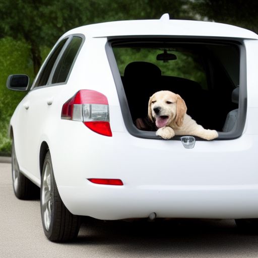

`提示词：1dog,car`

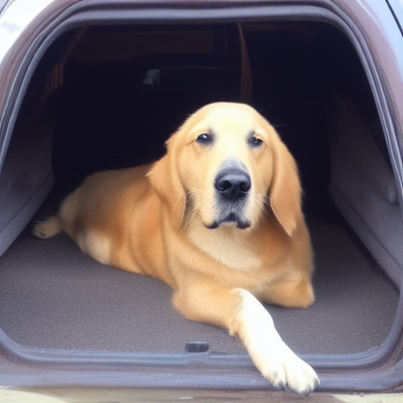

`说明`


#### 1.1.3 权重调节

> 根据一般原则，单词越靠前它的权重就越高，所以调整单词权重最直接的方式就是调整单词的顺序
>
> 越靠前的权重越高，越靠后的权重越低，除了可以通过单词顺序调节单词权重，还可以通过语法对单个单词的权重进行调节

`使用快捷键调节权重`

```
(best quality:1.3) 我们可以选中提示中的指定词汇，按照按住 ctrl+上箭头或者下箭头进行权重调节
```


`使用括号进行加权`

```
(best quality) = (best quality:1.1)
((best quality)) = (best quality:1.21) =  1.1 * 1.1
```


`说明`

- 权重的取值范围一般在 `0.5~1.5` 之间


#### 1.1.4 组成部分

> 提示词的编写一般都有固定的格式：`质量-媒介-主体-主体描述-背景-背景描述`

```
生成内容：一个穿着白色T恤的男孩，坐在放满书的书架前
masterpiece（质量）, bestquality（质量）, cg（媒介）, 1boy（主体）, sit（主体描述）, white t-shirt（主体描述）, bookshelf（背景）, full of books（背景描述）
```


#### 1.1.5  起手式

> 提示的起手式应该尽量简短，不必使用过多重复性的词语去描述相同的内容，我们给定的提示词越多，AI 绘画的时长就越久。
>
> 同时分配给每个词汇的注意也就越低，调试也就更加困难
>
> 而且现在模型相较于早期的时候在词汇的敏感性上已经有了很大的进步，不用担心因为提示词过短导致出图效果不佳


`正向起手式：`

```
masterpiece（杰作）,best quality（最高画质）,8k wallpaper（8k 壁纸）
```


`反向起手式`

```
worst quality（糟糕的画质）,normal qualtiy（普通的画质）,lowers（低分辨率）
```


### 1.2 采样器

> Stable Diffusion  提供了很多采样方法，目前常用的基本只有几种

`Euler`

- 是最简单最快的采样器


`Euler a`

- 更多样，不同的步数可以生产出不同的图片，但是如果步数太高的话（大于 30）效果不会太好


`DDIM` 

- 收敛快，但是效率相对较低，需要使用很多步数才能获取更好的结果，适合在重绘的时候使用


`LMS`

- `LMS` 是 `Euler` 的衍生，这两个采样器采用的同一种相关但是稍有不同的方法（平均过去几个步骤提高准确性）。大概 30 步数可以得到稳定的结果


`PLMS`

- `PLMS `也是 `Euler` 的衍生，`PLMS` 可以更好的去处理神经网络结构中的奇异性


`UniPC`

- `UniPC` 效果较好且速度非常快，对平面、卡通的表现较好，推荐使用。


### 1.3 采样步数

> Stable Diffusion 的工作方式是从以随机的高斯噪声起步，向符合提示的图像进行一步步降噪接近。
>
> 但是增加采样步数也会增加生成图像所需要的时间。增加步数的边际收益递减，取决于采样器，一般 设置为：`20~30` 之间

`不同采样器与不同步数生成结果`

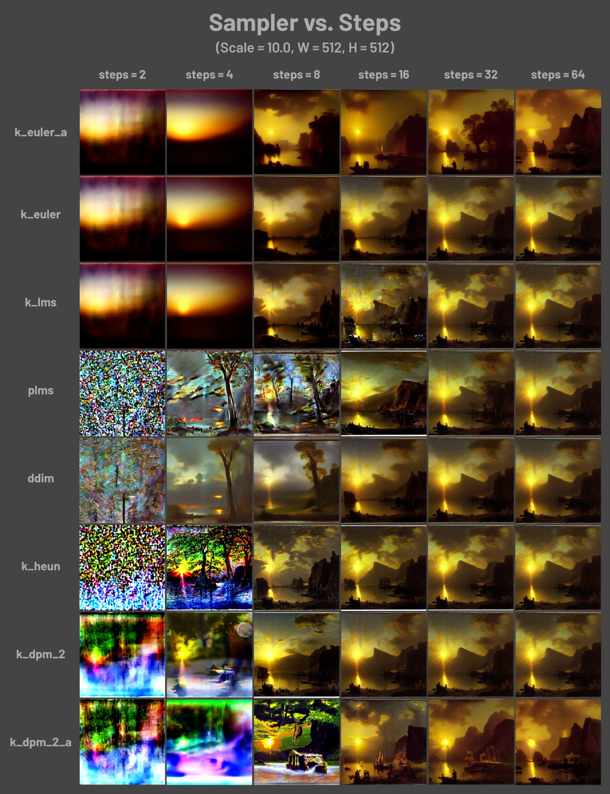


### 1.4 CFG Scale

> CFG Scale（提示词相关性），决定了生成的图像与提示词之间的匹配程度，增加 `Scale` 的值，可以让生成的图像更接近提示词
>
> 但是也会在一定程度上降低图片的质量。但是过高 `CFG Sscale` 会体现粗犷的线条，以及过于锐化的图像
>
> CFG Scale 的值一般设置到 `7~12`。

`CFG Scale 与采样器关闭对比图`

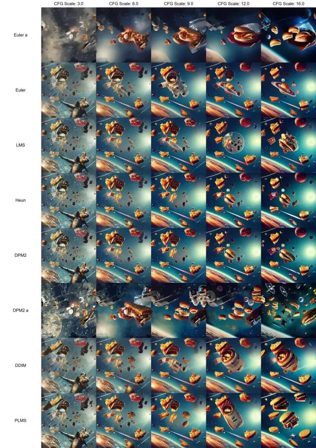

`说明`

- 调试的时候建议以 `0.5` 为步长进行为细微调节


### 1.5 批次和数量

> 批次决定了显卡生成几批图片
>
> 数量决定了显卡每批次，生成的图片数量

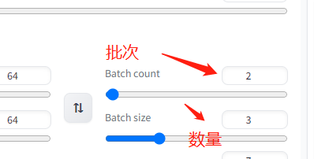

`说明`

- 显卡一次生成的图像数量为：批次 * 数量
- 如果我们想一次生成 `4` 张图片，那我们批次可以设置为 `1` 数量可以设置为 `4` ，这个速度是要大于：批次 `2` 数量 ：`2` 的速度
- 如果单次生成图片数量过多，就会导致显存不存从而生成失败
- 主要显存足够，只要耐心等待就会一直生成所有的图片，直到图片全部生成并输出


### 1.6 分辨率

> 图片生成的分辨率设置非常重要，它决定了我们图片的内容构成和图片的质量


#### 1.6.1 输出大小

> 图片的输出大小直接决定了画面内容的信息量，比如我需要在一张图片上显示一个小狗所有细节：项圈、毛发、斑点。
>
> 就需要我们图片有足够大的空间去表现这些内容，如果图片过小那么所有的内容都会挤成一团，没有办法去充分表现所有的细节

`说明`

- 但是图片的输出大小并不是越大越好，图片输出的大小和所 使用`GPU 的显存容量` 有着直接的关系
- 我们生成的图片越大，所占用的显存也就越大，那么所需要的生成时间也就越久
- 如果生成图片过大，并且我们提示词不足以去填充图片的大小，就会导致 `AI` 向图片中塞入更多的东西
- 绝大多数的模型都是 512*512 的分辨率下训练的，而少数的是 `768 * 768` 下训练。所以当我们给定图片大小过大，比如 `1024 *1024` ，`AI` 就会尝试向图片中塞入`2-3`张的图片内容，结果就是出现各种各样的 `肢体拼接`，不受词条控制的`多人`，`多角度`等问题 


`图片大小关系参考`

| 图片像素 | 图片大小    | 生成内容           |
| -------- | ----------- | ------------------ |
| 30w      | 512  * 512  | 大头照，半身照为主 |
| 60W      | 768 * 768   | 单人全身为主       |
| 100W     | 1024 * 1024 | 单人和两人、三人   |
| 更高像素 | 更大        | 画面直接崩坏       |


#### 1.6.2 宽高比例

> 宽高比例同样决定了图片生成的内容，这里以 `一个男孩的提示词为例`

`方图：512 * 512`


`高图：512 * 768`

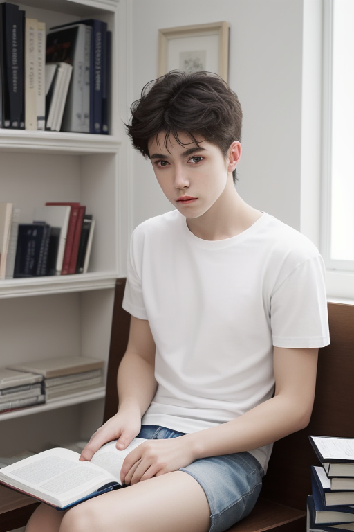

`宽图：768 * 512`


`说明`

- 方图：倾向于出脸和半身像
- 高图：倾向于站着和坐着的全身像
- 宽图：倾向于斜构图的半躺像


### 1.7 随机种子

> 随机种子决定了图片生成时涉及到的所有随机性，它初始化了 `Diffusion` 算法的起点初始值
>
> 固定随机种子可以锁定图片的初始潜在空间，意思是：其他参数不变。同一个随机种子值生成的图片应该完全一样

`seed：2450315369`

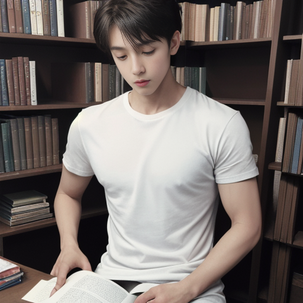


`seed:641507873`

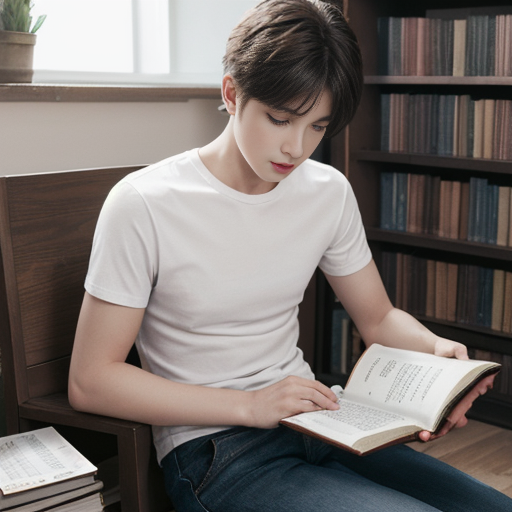

`说明`

- 种子数值设置为 `-1` 表示为随机种子数
- 当所有参数相同时时，种子数不同生成的图片也不一样
- 即使所有的参数和种子数都一致，也不能保证我们生成的图片和其他人完全一致，（显卡驱动、型号或其他因素）都会影响图片的实际输出


### 1.8 面部修复

> 面部修复在早期低分辨率的时候可以纠正错误的写实人脸，但是现在的模型脸部精度已经远超早期模型，所以这个功能无视即可


## 2 图生图

> 图生图其实就是在文生图的基础上增加了一张原图作为一个输入变量，而其他的一些参数：采样器、Scale 、批次、数量。使用方法和文生图一致

### 2.1 反推提示词

> 在图生图的功能页面中有两个按钮：Interrogate CLIP、Interrogate DeepBooru
>
> 我们可以通过一张图反推出图片的图信息，`CLIP` 是反推出图片的详细描述，`DeepBooru`  是反推出图片的关键词组

`示例图片`


`CLIP`

```
a man sitting on a bench in front of a book shelf with books on it and a book case behind him, a photocopy, aestheticism, ethereal, An Gyeon
一个男人坐在书架前的长凳上，上面放着书，身后是书柜，复印件，唯美，空灵，安谦
```


`DeepBooru`  

```
1boy, black hair, book, book stack, bookmark, bookshelf, brown eyes, chair, holding book, indoors, ladder, library, male focus, menu, open book, pants, reading, realistic, shirt, short hair, sitting, solo
1boy，黑发，书，书架，书签，书架，棕色眼睛，椅子，拿着书，室内，梯子，图书馆，男性焦点，菜单，翻书，裤子，阅读，写实，衬衫，短发，坐着，独奏
```


### 2.2 重绘幅度

> 在图生图中最重要的参数就是重绘幅度，重绘幅度的数值决定了重绘的后的图片相比原图的相似程度

`示例图片`


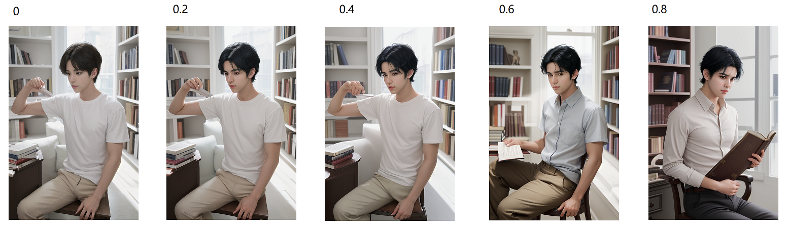


`说明`

- 重绘幅度的取值范围为：0-1
- 重绘幅度值越小，重绘图片相比原图的相似度越高
- 重绘幅度值越大，重绘图片相比原图的相似度越低
- 设置为 0 ，重绘图片和原图完全一致
- 设置为 1 ，重绘图片和原图毫无关系


## 3 高清修复

> 在使用高清修复功能后，生成的图片相较于原图会更加清晰。也会在图片中添加更多的细节
>
> 那么相对应所占用的 GPT 显存也会增加，图片生成的速度也会降低

### 3.1  文生图高清修复


`未放大`


`1.3 倍`

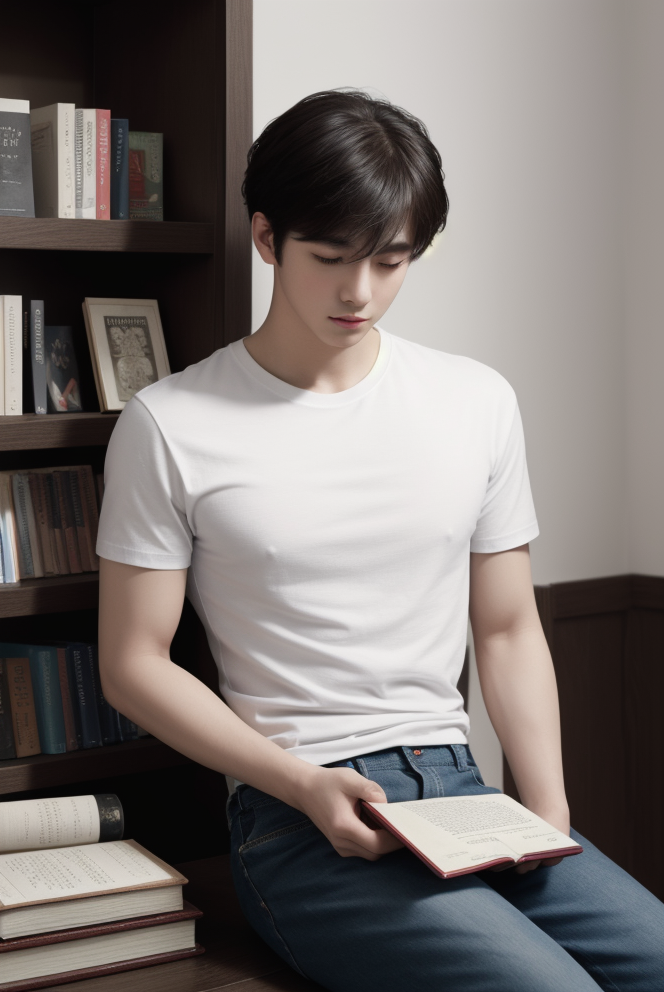


### 3.2 图生图高清修复

> 在文生图中可以高清修复的功能，那么图生图同样也可以，功能选项是 `Resize By`

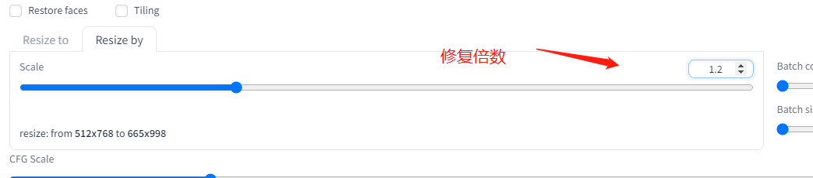


`原图`


`重绘后：1.3 倍图`


## 4 生成汽车图

> 其实我们只需要写好对应的提示词，然后对各项参数进行微调，来生成我们的图片

`正向提示词`

```
((masterpiece,best quality)), ultra-detailed, 4k, cinematic, blue widebody sports car, onyx black mercedes CLS, <lora:WidebodyCars:0.8>
```


`反向提示词`

```
ng_deepnegative_v1_75t,easynegative,(worst quality:2), (low quality:2), (normal quality:1.8), lowres, ((monochrome)), ((grayscale)),sketch,ugly,morbid, deformed,logo,text, bad anatomy,bad proportions,disfigured,extra arms, extra legs, fused fingers
```


`采样器`

```
DPM++ 2M Karras
```


`模型`

```
ghostmix_v20Bakedvae
```


`CFG Scale`

```
7
```


`Steps`

```
30
```


`Seed`

```
2645154649
```


`说明`

- 可以使用高清修复功能，生成更高质量的图片。

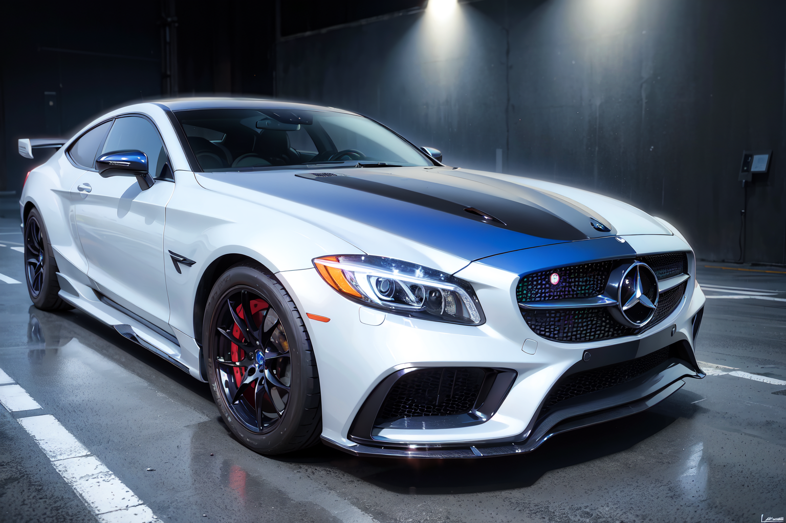


