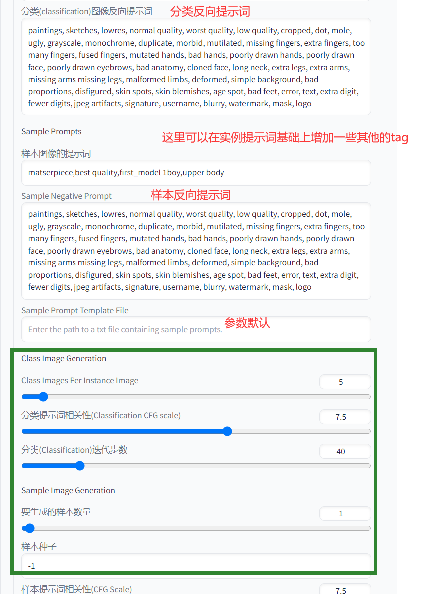

### Stable Diffusion 模型训练

### 1 准备工作

> `Stable Diffusion` 在安装扩展的时候，会进行安全检查导致扩展安装失败。
>
> 我们需要在启动指定的后面增加参数 

`更改服务文件`

```shell
# 删除旧的服务文件
sudo rm /etc/systemd/system/diffusion.service
# 创建新的服务文件
sudo nano /etc/systemd/system/diffusion.service
```


`更改后的服务文件内容`

```shell
[Unit]
Description=Diffusion Service

[Service]
User=ubuntu
WorkingDirectory=/home/ubuntu
ExecStart=/bin/bash /home/ubuntu/stable-diffusion-webui/webui.sh --listen --enable-insecure-extension-access --xformers
Restart=always

[Install]
WantedBy=multi-user.target
```


`重载服务`

```shell
sudo systemctl daemon-reload
sudo systemctl restart diffusion
```


`安装 xformers 依赖`

```shell
conda activate diffusion_1
pip install xformers
```


### 1 安装汉化包


### 2 安装 Dreambooth 扩展

> 安装 Dreambooh和安装汉化包是一样的，只需要在扩展界面中加载扩展列表。
>
> 容纳后找到 `Dreambooth` 安装即可


### 3 导入训练素材

> 在训练前我们需要先准备好训练所需要的素材，这里训练采用的图片大小还是 `512 * 512`

```shell
# 来到项目目录下，创建一个 train 目录用于存放所有训练相关的数据
cd /home/ubuntu/stable-diffusion-webui && mkdir train

# 创建一个 first_model 作为我们本次模型训练的存储目录
cd train && mkdir first_model

# 再创建两个文件夹，分别是模型数据输入目录和输出目录
cd first_model && mkdir first_model_in first_model_out
```


`导入模型训练数据`


`说明`

- 我们需要把本地的图片，上传到 `train(所有模型)->first_model(本次模型目录)->first_model_in(模型输入目录)` 下

- 因为 `xshell` 不能直接进行文件上传，所以我这里使用的是 `WINScp` 工具  ，大家也可以根据自己喜好选择


### 4 素材图像处理


### 5 模型创建


### 6 模型训练





### 