# Stable Diffusion 实战教学

## 第一章 Stable Diffusion 本地搭建

### 1.1 安装 Python

> 我们需要先安装 Python 的运行环境，`Stable Diffusion` 指定的 `Python` 版本为 `3.10.6`
>
> `Python 3.10.6` ：https://www.python.org/ftp/python/3.10.6/python-3.10.6-amd64.exe

`安装 Python`


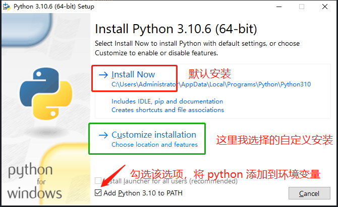


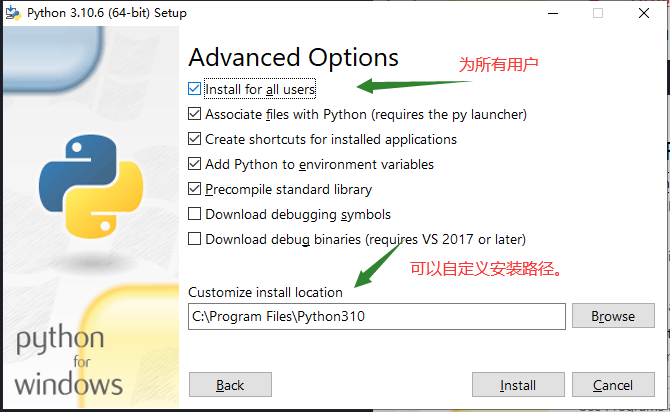

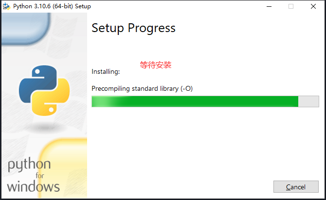


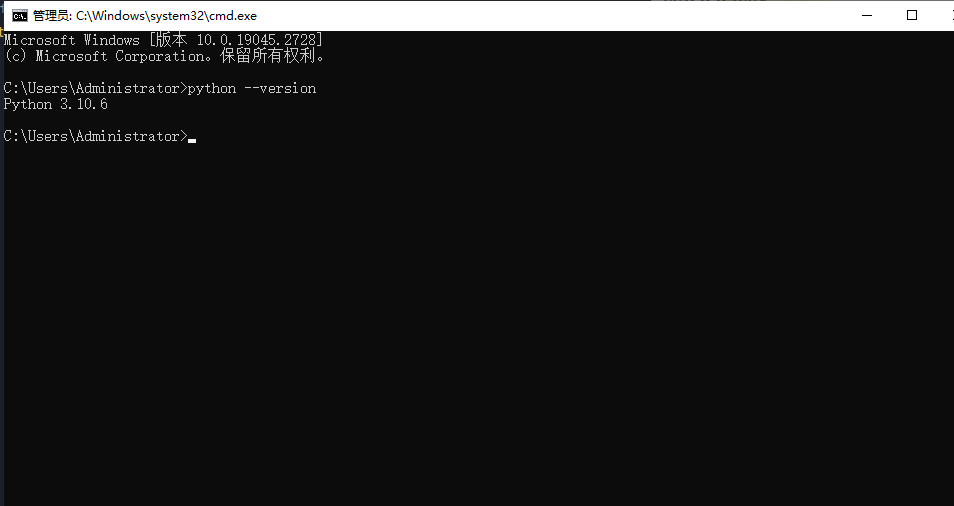


### 1.2 安装 git

> `Git` 是一款分布式版本控制系统，可协助开发人员管理和协作编写代码。在这里，我们可以使用 `git` 工具来进行 `Stable Diffusion` 项目代码的 `clone` 操作。


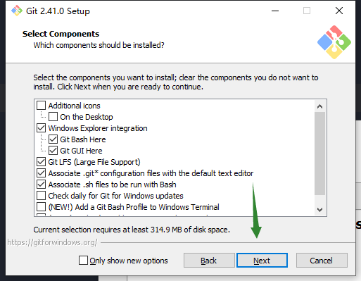


### 1.3 克隆项目

> `Stable Diffusion` 作为一个开源项目，我们只需要将代码通过 `git` 工具 `clone` 到本地，然后进行部署即可
>
> 项目地址：https://github.com/AUTOMATIC1111/stable-diffusion-webui

`克隆项目`

```shell
git clone https://github.com/AUTOMATIC1111/stable-diffusion-webui.git
```


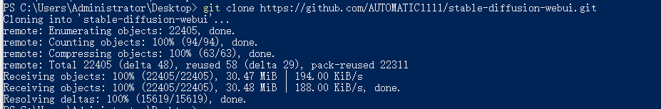

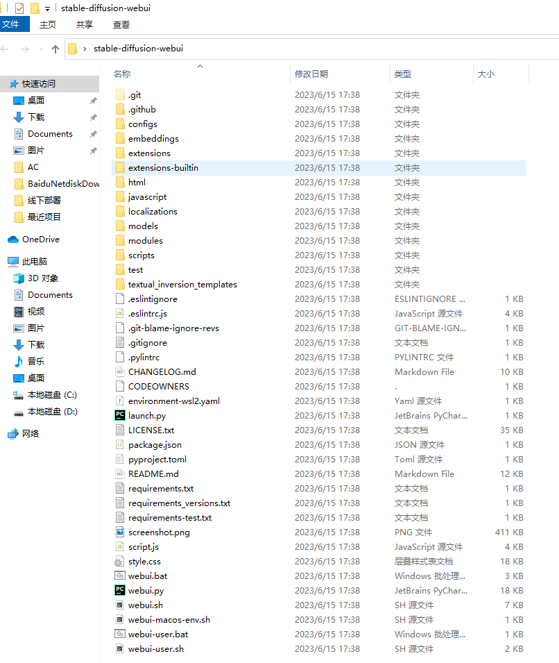

`说明`

- 项目克隆完成之后，就会在当前位置创建一个项目的文件夹。

  

### 1.4 部署 Stable Diffusion

> 部署 `Stable Diffusion` 也很简单，只需要运行项目目录下 `webui.bat` 脚本文件即可


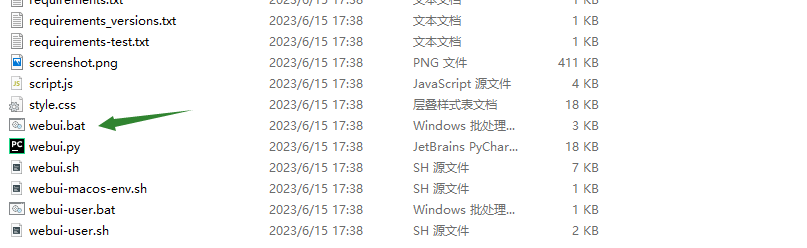

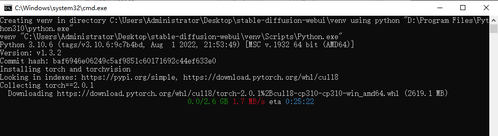

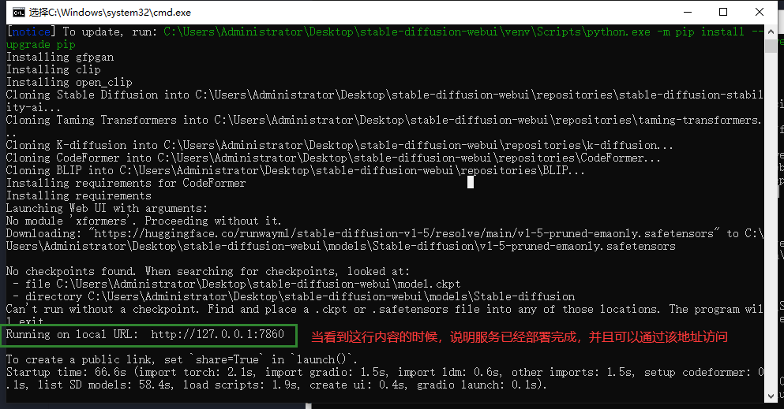


`说明`

- 双击运行之后，该脚本会自动安装项目所有依赖，并自动启动


### 1.5 下载模型

> 项目部署成功后，默认只下载了一个 `数据模型：v1-5-pruned-emaonly.safetensors`
>
> 模型的存放路径为： `/stable-diffusion-webui/models/Stable-diffusion` ，我们下载的模型，需要放到该目录下
>
> 模型可以通过各个 `AI 模型平台进行下载`，比如：<a href="https://civitai.com/">civitai</a>、<a href="huggingface"> huggingface </a>... ，这里以 `civitai` 平台模型为例


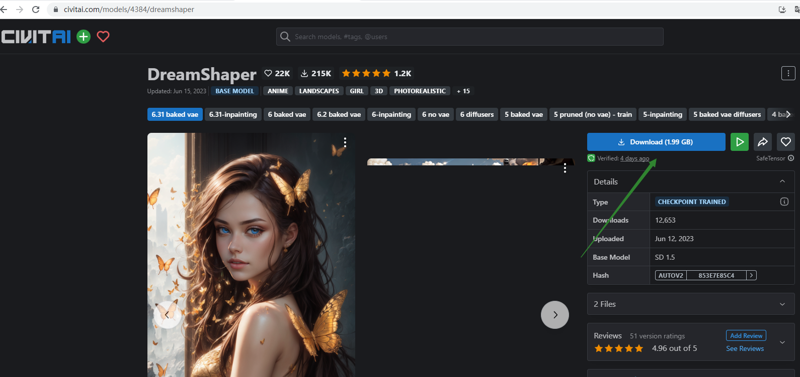

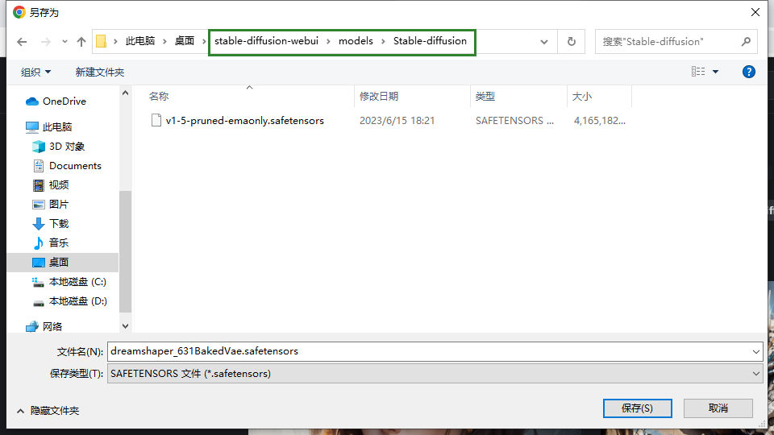

`说明`

- 保存的地址一定是 /项目/models/Stable-diffusion 文件夹
- 下载时最好开启代理（下载服务器在国外，如果不开代理的话本地下载会非常慢）
